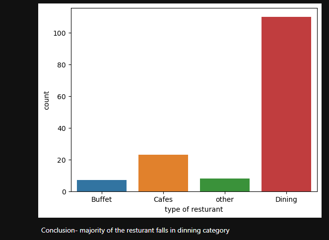
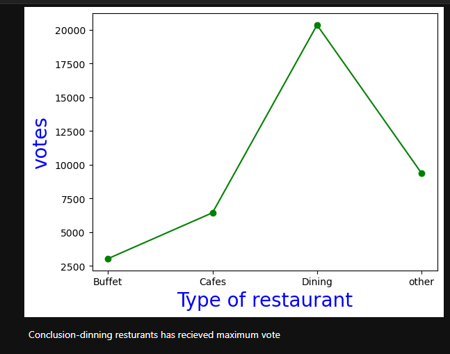
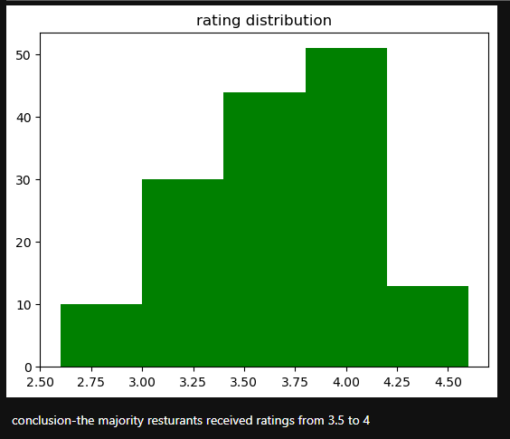
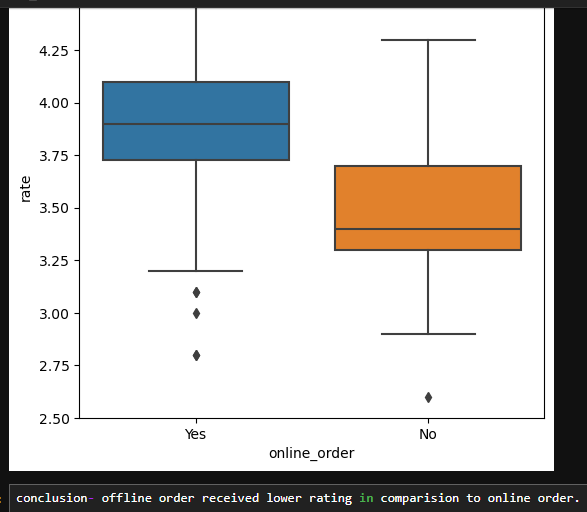
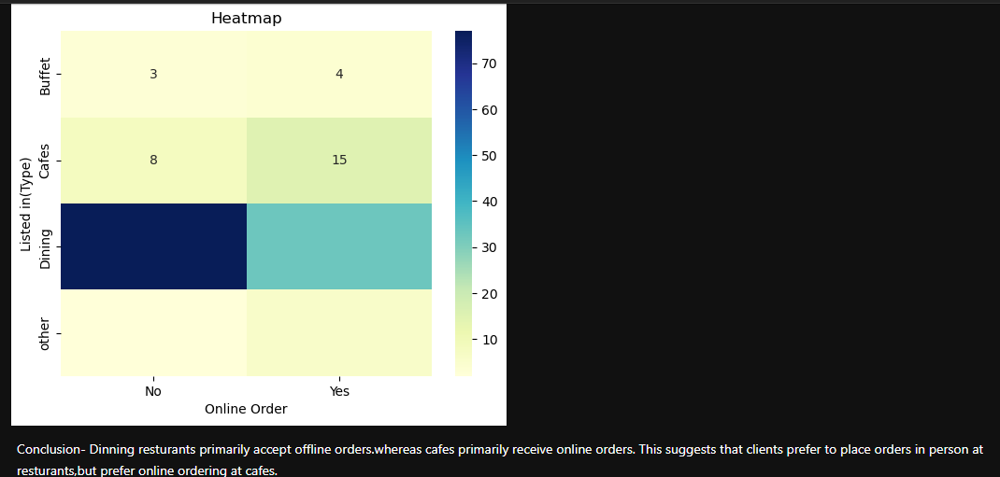

# Zomato Data Analysis and Visualization

## Overview
Zomato, a leading food delivery service, boasts an average of 17.5 million monthly transacting customers. The platform has seen an 8.7% year-on-year increase in monthly active food delivery restaurant partners, growing from 208,000 to 226,000. As a data professional at Zomato, you are tasked with analyzing a dataset of customers, performing Exploratory Data Analysis (EDA), and visualizing the results to answer key business questions.

## Objectives
1. Identify the type of restaurant the majority of customers order from.
2. Determine the number of votes each type of restaurant has received from customers.
3. Analyze the ratings that the majority of restaurants have received.
4. Calculate the average spending on each order by couples.
5. Compare the ratings received by online and offline modes.
6. Identify the type of restaurant that received more offline orders to target customers with attractive offers.

## Analysis and Visualization

### 1. Majority Restaurant Type Ordered By Customers
To determine the most popular restaurant type, analyze the frequency of orders from different restaurant types.

### 2. Customer Votes for Each Restaurant Type
Count the votes each restaurant type has received to gauge customer preferences and satisfaction levels.

### 3. Majority Restaurant Ratings
Examine the distribution of ratings across restaurants to identify common rating trends.

### 4. Average Spending by Couples
Filter the dataset for orders placed by couples and calculate the average spending per order.

### 5. Ratings Comparison: Online vs Offline Mode
Compare the average ratings for orders placed online and offline to identify which mode is preferred by customers.

### 6. Offline Orders by Restaurant Type
Analyze the number of offline orders for each restaurant type to determine where to focus marketing efforts and offer promotions.

## Conclusion
By answering these questions, Zomato can better understand customer preferences, optimize marketing strategies, and enhance the overall customer experience. The insights gained from this analysis will enable data-driven decision-making and contribute to the growth and success of Zomato's food delivery business.

## Instructions for Analysis
1. **Load the dataset**: Import the dataset into your preferred data analysis tool (e.g., Python, R).
2. **Perform EDA**: Explore the data to understand its structure, clean any missing or inconsistent data, and visualize key attributes.
3. **Analyze and visualize**: Use appropriate statistical and visualization techniques to answer the specified questions.
4. **Interpret results**: Draw insights from the analysis and provide recommendations based on the findings.

By following these steps, you will be able to perform a comprehensive analysis of Zomato's customer data and provide valuable insights to drive business growth.
